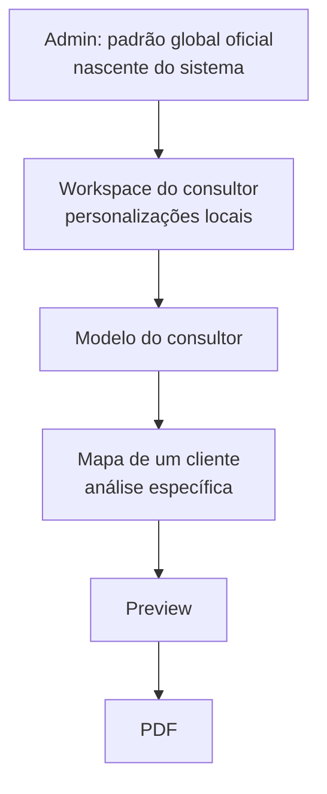
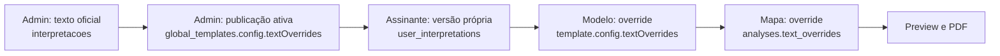
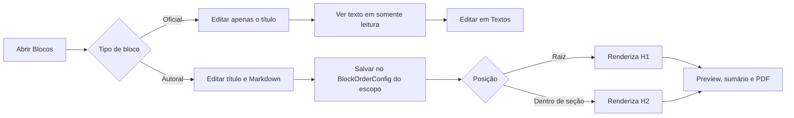
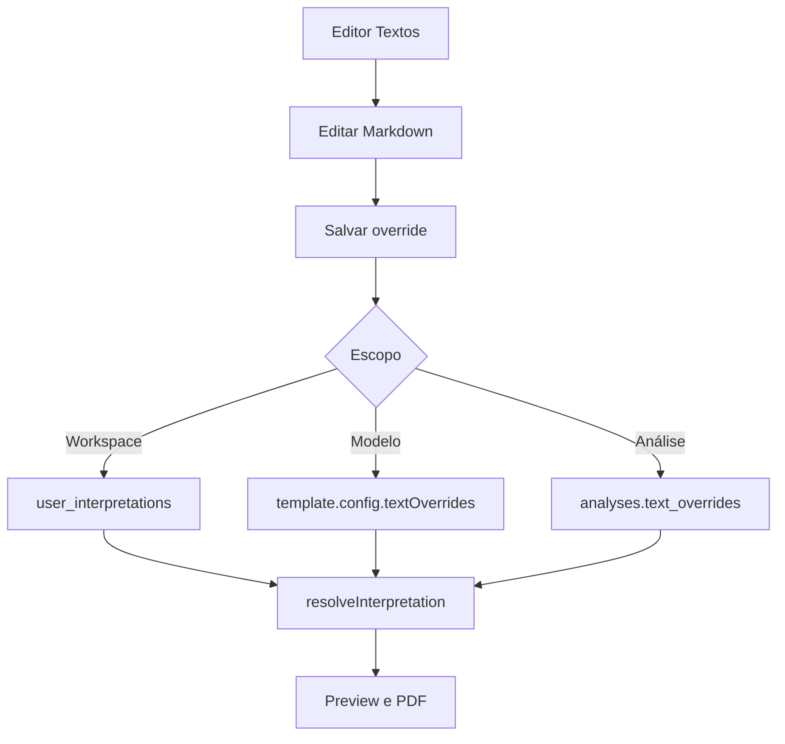

# Personalização, Salvamento e Restauração

Documento de referência para qualquer mudança em Templates, Blocos, Textos, preview ou PDF. Atualizado em 2026-08-19.

## Base do Sistema

A área administrativa `admin.vibraweb.com.br/admin/base` concentra a autoria oficial do produto. Ela agrupa **Estilos**, **Blocos** e **Textos** para que qualquer conteúdo criado ali seja tratado como base do sistema quando chegar ao workspace: o assinante pode herdar e sobrepor, mas nunca editar ou excluir a origem.

## Princípio

Cada tipo de conteúdo tem uma única fonte de edição, mesmo quando aparece em mais de uma tela. Preview e PDF recebem a configuração efetiva calculada por essa cascata; nunca devem reconstruir regras próprias.

Uma camada só grava um override quando o usuário salva naquele escopo. A camada mais próxima do mapa vence para o mesmo dado. Nenhuma ação de uma camada filha pode gravar na camada pai. O **Admin** é a nascente definitiva: somente `admin.vibraweb.com.br` pode alterar os textos-base, a ordem-base, os blocos-base e o visual-base que sustentam todo o produto.

### Regra de Herança

| Onde a pessoa edita | O que muda | O que permanece intacto |
|---|---|---|
| **Admin / Padrão Global** | A base oficial do Vibraweb para todos os workspaces e novos mapas | Configurações já salvas por consultores, modelos e análises |
| **Workspace** | Uma personalização daquele consultor para seus próximos mapas | O padrão global oficial do Admin e dados dos outros consultores |
| **Modelo** | Apenas aquele modelo e os novos mapas que o selecionarem | Padrão do workspace, outros modelos e análises já salvas |
| **Mapa do cliente** | Somente aquele mapa/análise, daquele cliente | Modelo de origem, workspace e Admin |

Essa regra é idêntica para **Visual**, **Textos** e **Blocos**. Selecionar um modelo durante a criação define a base do mapa. A partir daí, qualquer edição feita no fluxo daquele cliente grava em `analyses` como override local e nunca volta para o modelo selecionado.

### Padrão Global Oficial e Textos Protegidos

O **Padrão Global** é a base oficial do Vibraweb e pertence exclusivamente ao Admin. Não há uma camada editável acima dele: o que for publicado no CRUD administrativo dita a base do sistema. O texto padrão não pertence ao assinante: deve sempre continuar disponível como fallback, mesmo quando há uma personalização em alguma camada filha.

- Somente o **Admin** pode criar, editar ou excluir um texto oficial em `interpretacoes` e publicar a versão global ativa.
- O assinante não altera nem exclui `interpretacoes` ou o template global publicado. Ao salvar em **Personalizar Textos**, cria/atualiza apenas sua linha em `user_interpretations`.
- **Restaurar padrão** e **Redefinir todos os textos**, no workspace, removem somente os overrides do próprio usuário. O próximo valor visível volta a ser a publicação ativa do Admin ou, na ausência dela, o texto oficial.
- O modelo e o mapa seguem a mesma proteção: seus restores removem apenas o override da própria camada e revelam a camada anterior.

#### Controles de acesso

- A gestão dos textos-base acontece na superfície administrativa: `admin.vibraweb.com.br/admin/texts` (localmente, `/admin/texts`). A aplicação identifica o subdomínio `admin.` e abre o login/shell administrativo.
- A rota usa `AdminGate`, que exige `user_profiles.role = 'admin'` antes de renderizar o painel.
- A garantia definitiva está no Neon Postgres: a política RLS `Admins manage global interpretations` em `interpretacoes` permite `INSERT`, `UPDATE` e `DELETE` somente quando `private.is_admin()` é verdadeira. Esconder um botão nunca é considerado autorização.
- O mesmo padrão RLS protege `global_templates` e `global_settings`, que compõem o Padrão Global visual e estrutural.

## Onde Cada Dado Vive

| Domínio | Padrão Global/Admin | Personalização do workspace | Modelo | Mapa/análise |
|---|---|---|---|---|
| Visual | `global_templates.config` | `user_profiles.brand_config` | `brand_config.templates[].config` | `analyses.template_id` seleciona o modelo; futuros ajustes visuais locais devem ser persistidos como override da análise |
| Ordem, títulos e blocos | `global_templates.config.blockOrder` | `user_profiles.block_order` | `template.config.blockOrder` | `analyses.block_order` |
| Textos oficiais | `interpretacoes` e a publicação ativa em `global_templates.config.textOverrides` | `user_interpretations` | `template.config.textOverrides` | `analyses.text_overrides` |
| Texto de bloco autoral | `global_templates.config.blockOrder.customBlocks` | `user_profiles.block_order.customBlocks` | `template.config.blockOrder.customBlocks` | `analyses.block_order.customBlocks` |

`BlockOrderConfig` é JSONB e contém `order`, `hidden`, `children`, `titleOverrides` e `customBlocks`. Não foi criada uma tabela nova para blocos: isso mantém a configuração atômica com a ordem em que ela é usada.

## Fluxo de Blocos

- Blocos oficiais: o modal permite mudar apenas o título. O texto é mostrado bloqueado e o botão **Editar em Textos** abre a introdução/texto geral já selecionado. Não duplicar esse texto em `customBlocks`.
- Blocos autorais: título e texto são editados juntos, com `MarkdownEditor`, o mesmo editor rico usado em Textos. Eles não aparecem na página Textos: duplicar o mesmo campo em duas telas criaria duas fontes de verdade.
- Ao arrastar um bloco autoral para a raiz ele é uma seção H1. Ao soltá-lo dentro de outra seção ele passa a H2. Blocos oficiais não mudam de pai.
- O sumário usa os IDs de bloco efetivos e a paginação medida; cada bloco autoral aparece com seu número real de página.

## Fluxo de Textos Oficiais

Os textos oficiais possuem revisão não destrutiva: cada entrada pode manter até 10 versões anteriores (`versoes`), com data. Restaurar uma versão cria uma nova revisão, em vez de apagar a atual. O marcador `sistema: true` força o texto oficial de `interpretacoes` e ignora as personalizações do workspace, modelo e mapa.

## Salvamento e Cancelamento

- **Blocos do Padrão Global:** ficam em `global_templates.config.blockOrder` e são publicados pelo administrador.
- **Blocos do workspace:** `updateUserProfile({ block_order })`; criam uma personalização local e nunca publicam no Padrão Global.
- **Blocos do modelo:** ficam no rascunho de `editingConfig.blockOrder` e só chegam ao perfil quando o cabeçalho executa **Salvar modelo**.
- **Blocos da análise:** `updateAnalysis({ block_order })` no passo de organização daquele cliente. Quando o mapa foi iniciado com um modelo, ele começa herdando a ordem desse modelo; ao salvar uma mudança, o resultado é exclusivo daquele mapa.
- **Cancelar/Descartar:** restaura o último estado carregado/salvo daquela tela. Não deve alterar a camada de baixo.
- **Restaurar padrão:** remove o override daquele escopo; não apaga o padrão das demais camadas.

### Editor de Modelo: Ação Única de Salvamento

As três áreas de um modelo - **Visual**, **Blocos** e **Textos** - compõem um único rascunho. A única ação que grava esse rascunho no banco é **Salvar modelo**, no cabeçalho. Rodapés dessas áreas não devem repetir Salvar, Voltar, Cancelar ou Descartar.

- Em **Visual**, `Redefinir para o padrão global` aparece somente quando há diferença visual relevante e recoloca o visual publicado pelo Admin, sem tocar em blocos ou textos.
- Em **Blocos**, a mesma ação remove `template.config.blockOrder`, fazendo o modelo voltar a herdar o Padrão Global.
- A redefinição apenas altera o rascunho; ela passa a valer para o modelo após **Salvar modelo** no cabeçalho.
- Ao reabrir um modelo já salvo, `Redefinir para o padrão global` continua disponível quando houver uma camada personalizada. Se houver uma nova edição ainda não salva, surge ao lado `Restaurar versão salva`, que descarta o rascunho inteiro e recupera a última configuração persistida daquele modelo. Modelos novos ainda sem primeiro salvamento não exibem essa ação.

### Restauração na Edição Global

No Admin, a camada editada é a própria origem da cascata. Por isso os botões usam **Restaurar padrão do sistema**, nunca “padrão global”: não existe uma camada editável acima dela para herdar. Essa é uma ação deliberada do administrador para os defaults de fábrica; depois de salva, ela passa a ditar a nova base do sistema.

- Em **Visual**, recompõe `VIBRAWEB_DEFAULTS` e preserva apenas blocos e textos, que pertencem às suas abas próprias.
- Em **Blocos**, recompõe `DEFAULT_BLOCK_ORDER`.
- Em **Textos**, remove as publicações daquele template global e volta a revelar os textos oficiais em `interpretacoes`.
- Como no modelo, a restauração só é persistida pelo botão de salvar da respectiva aba.

## Auditoria: Estado Atual e Próximo Passo

| Recurso | Estado atual |
|---|---|
| Versões de textos oficiais | Implementado, máximo 10 por campo |
| Restauração de textos | Implementada e não destrutiva |
| Histórico/auditoria de blocos, ordem e visual | Ainda não implementado |
| Restauração de template/bloco | Hoje restaura o estado salvo no editor; não há linha do tempo persistida |

Antes de declarar auditoria de blocos como recurso comercial, criar uma tabela de revisões imutáveis por recurso e escopo, com `actor_id`, `created_at`, `before`, `after` e origem da ação. A restauração deve criar uma nova revisão, nunca sobrescrever a anterior.

## Regras de Implementação

1. Todo dado que altera o PDF precisa aparecer no preview usando o mesmo `buildDocumentBlocks` e a mesma paginação medida.
2. Não adicionar editor duplicado para texto oficial dentro de Blocos.
3. Mudanças em modelos devem preservar o rascunho entre Visual, Blocos e Textos até o salvamento geral do modelo, sem tocar no workspace ou no Admin.
4. Em novas telas administrativas, reutilizar `DocumentOrganizerView` e `BlockOrderPanel`; não copiar a árvore de drag-and-drop.
5. Qualquer novo tipo de override deve declarar explicitamente: dono, camada, regra de herança, destino de restauração e estratégia de auditoria.
6. Ajustes locais de um mapa devem ser salvos em `analyses`; não mutar o `template_id` escolhido nem o JSON de configuração do modelo.

## Responsividade e Uso Multidispositivo

Todo fluxo do Vibraweb, inclusive Admin, criação de modelos, edição de textos, blocos, preview e PDF, deve manter a mesma capacidade funcional em telas pequenas, dobráveis, tablets e desktop. A referência é Material Design, com decisões guiadas pelo espaço realmente disponível do conteúdo, e não pelo nome do aparelho.

| Contexto | Comportamento obrigatório |
|---|---|
| Telefone compacto, incluindo iPhone mini | Uma coluna; áreas de toque com pelo menos 44 px; sem dependência de hover; modais usam `100dvh`/safe areas e nunca cortam ações de salvar ou cancelar. |
| Telefone padrão e telas altas | Conteúdo prioritário acima; controles secundários com divulgação progressiva; editor e preview podem alternar por tela quando disputam largura. |
| Dobráveis fechados e tela dividida estreita | Mesmo comportamento de telefone compacto. Nunca presumir largura por causa da altura ou da densidade de pixels. |
| Dobráveis abertos, iPad mini e tablets em retrato | Layout de duas áreas quando a coluna de edição mantiver ao menos 320 px e o conteúdo principal continuar legível; caso contrário, empilhar/alternar painéis. |
| iPad Air, iPad Pro e tablets Samsung em paisagem | Master-detail ou painel lateral + conteúdo, com larguras máximas de leitura e preview; nenhum painel deve se esticar sem limite. |
| Desktop e tela ampla | Sidebar persistente e painéis simultâneos, preservando medidas máximas para editor, formulário e página de documento. |

- Usar `minmax(0, ...)`, `min-width: 0`, `max-width`, `clamp()` e grid/flex para evitar estouro de texto e saltos de layout.
- Todo controle essencial precisa ser alcançável por toque, teclado e leitor de tela; ações não podem depender apenas de hover ou drag-and-drop.
- Em fluxos com preview e edição, a prioridade em telas estreitas é o editor; o preview abre em tela/painel próprio sem descartar o rascunho.
- Modais e barras fixas devem respeitar `env(safe-area-inset-*)`, teclado virtual e `100dvh`, com rolagem interna quando necessário.
- Antes de finalizar uma tela alterada, validar desktop e mobile; quando houver layout de painel, conferir também uma largura intermediária de tablet/dobrável.
